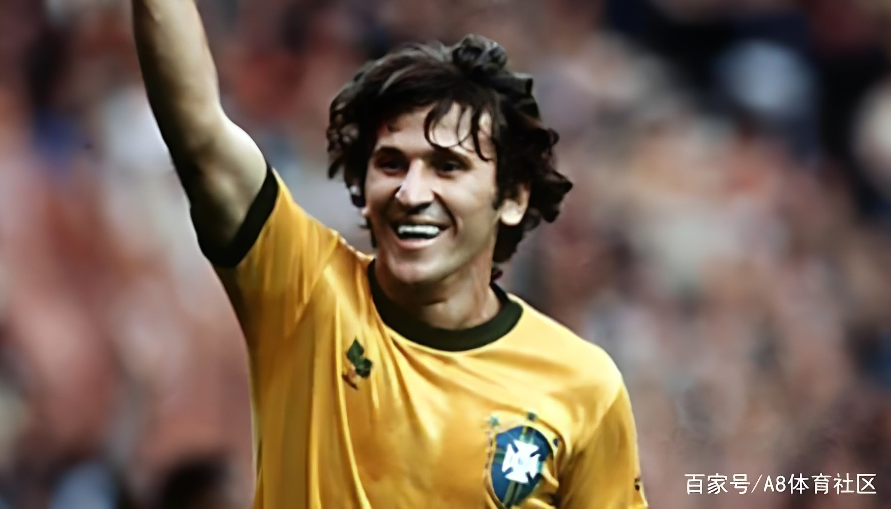

# Real-ESRGAN_paddlesport 使用Real-ESRGAN对足球场景进行超分辨率重建

Real-ESRGAN: Training Real-World Blind Super-Resolution with Pure Synthetic Data

官方源码：[https://github.com/xinntao/Real-ESRGAN](https://github.com/xinntao/Real-ESRGAN)

**Paddle模型复现地址**：[https://github.com/sldyns/Real-ESRGAN_paddle_Lite](https://github.com/sldyns/Real-ESRGAN_paddle_Lite)

## 1. 简介

本项目基于PaddlePaddle对Real-ESRGAN网络复现的仓库，该网络如上图所示。本项目使用将论文作者用pytorch训练好的权重转为paddle的权重作为预训练模型，再运用足球场景高分辨率数据finetune训练，针对足球场景的低分辨率图像进行超分辨率重建

### 待完善的内容

- 由于本模型使用的数据集是自制数据集，高分辨率图像是通过`ffmpeg`选取关键帧的方式从高清蓝光的欧冠决赛中选取的，数据中有可能并不全是质量很高的足球场景图像，导致模型效果没达到最佳，可以对关键帧图像质量进行评价再进一步筛选成为训练集；
- 模型训练了102500次iter，共计82个小时，有可能继续训练效果会更好一些；

## 2. 足球场景超分辨率效果

使用从百度百科上搜到的低分辨率足球图像进行测试，对比不进行足球场景finetune的Real-ESRGAN权重，展示的最后一张为我初中时候的足球场景照片：

| LQ | origin-Real-ESRGAN | finetune-Real-ESRGAN | 
|--- | --- | --- |
| |   |  |
| |   |  |
| |   |  |
| |   |  |
| |   |  |

- 如果不进行finetune，则超分后的图像会有不真实的感觉，例如第一张图的面部、第二张图的马拉多纳的手臂和背景观众、第三张图的背景球员、第四张图的教练席、第五张图的面部
- 足球场景中一般聚焦于场上球员，背景是虚化的，原始的权重会对虚化的背景也进行重建而导致有失真的感觉

